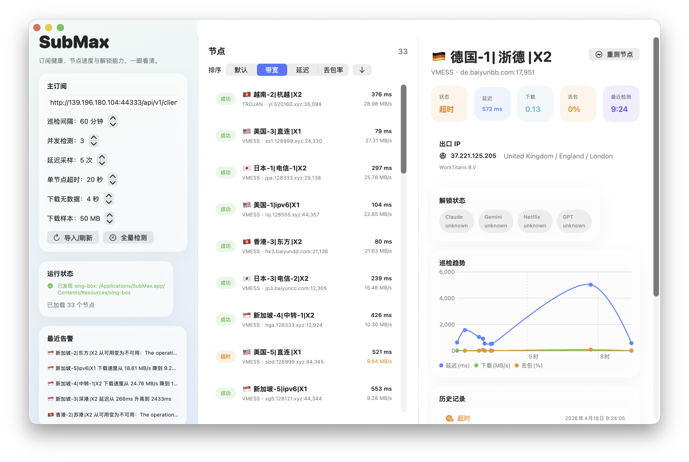

# SubMax

> A native macOS app for subscription health checks, node speed tests, and unlock monitoring.
>
> 一个给机场订阅用户做节点健康检查的原生 macOS 工具：看延迟、带宽、丢包、出口 IP，以及 Netflix / GPT / Gemini / Claude 的可达性。



## 它解决了什么痛点

如果你也有这些烦恼，SubMax 就是为这个场景做的：

- 订阅链接里节点很多，但你不知道哪些节点今天突然挂了。
- 你知道“能连上”，但不知道它到底是慢、丢包高，还是下载吞吐很差。
- 你想知道某个节点能不能访问 `Netflix`、`OpenAI / GPT`、`Gemini`、`Claude`。
- 你想看巡检历史，不只是看某一瞬间结果。
- 你不想搭后台，不想上云，只想在自己 Mac 上有一个本地可视化工具，随时检查自己的订阅质量。

SubMax 的核心目标不是“管理机场账号”，而是把**订阅节点的健康状况**看得更清楚、更稳定、更持续。

## Search-Friendly Summary

SubMax is a native macOS app for:

- subscription link health checks
- proxy node latency tests
- proxy node bandwidth tests
- packet loss monitoring
- exit IP detection
- Netflix / OpenAI / Gemini / Claude reachability checks

If you are searching for a `macOS proxy checker`, `subscription node tester`, `trojan vmess speed test`, or `unlock checker for GPT / Gemini / Claude`, this project is built for that workflow.

## 适合谁

- 想在 macOS 上做机场订阅测速、节点健康检查、解锁检测的人
- 手里有 `trojan://` 或 `vmess://` 订阅链接，想知道节点最近到底稳不稳的人
- 想长期观察“延迟、下载速度、丢包率、出口 IP 变化”的人
- 想先本地自己用，不想折腾服务端和数据库部署的人

## 核心能力

- 导入一个主订阅链接，支持 Base64 包裹的 `trojan://` 和 `vmess://` 节点列表
- 自动过滤“剩余流量、套餐到期、官网、更新订阅”等说明性伪节点
- 节点列表支持按带宽、延迟、丢包率排序
- 支持全量检测和单节点重测
- 支持自定义并发检测数
- 支持自定义延迟采样次数、单节点超时、下载无数据超时、下载样本大小
- 每次巡检记录：
  - 延迟
  - 下载速度
  - HTTP 探测丢包率
  - 出口 IP / 国家 / 地区 / 城市 / 运营商
  - Netflix / GPT / Gemini / Claude 可达性
- 提供节点历史趋势图
- 提供最近历史记录和本地异常告警
- 支持检测中实时看到哪些节点正在测试
- 支持手动停止当前检测任务

## 结果怎么理解

SubMax 不只是给一个“能不能用”的二元结果，而是尽量把原因拆开：

- `成功`
  - 节点连通成功，延迟、下载和巡检结果可用
- `失败`
  - 明确失败，例如代理启动失败、基础连通失败、下载测速失败
- `超时`
  - 单节点检测超过时间上限，但不会直接当成“节点已挂”
  - 超时前已经测到的延迟、丢包、下载速度、出口 IP 仍然会保留展示

这能避免把“很慢”误判成“完全不可用”。

## 为什么是原生 macOS App

SubMax 是一个本地原生 macOS 应用，不需要额外部署服务端：

- 数据保存在本地 SQLite
- 探测依赖内置 `sing-box`
- 不接管系统代理
- 不上传订阅内容到云端

这意味着它更适合“自己长期观察自己的订阅质量”，而不是做机场后台或多人平台。

## 快速开始

### 方式 1：本机直接使用

```bash
git clone <your-repo-url>
cd subMax
./script/install_sing_box.sh
./script/build_and_run.sh --verify
cp -R dist/SubMax.app /Applications/
```

然后直接在 `应用程序` 里打开 `SubMax.app`。

如果 macOS 首次提示无法验证开发者，可以右键 `SubMax.app` -> `打开`，或执行：

```bash
xattr -dr com.apple.quarantine /Applications/SubMax.app
```

如果后面你把它发布到 GitHub Releases，可以把构建后的 `SubMax.dmg` 放到 Release 附件里，README 这套说明可以继续直接复用。

### 方式 2：从源码运行

```bash
cd subMax
./script/install_sing_box.sh
./script/build_and_run.sh
```

### 方式 3：打包发布文件

默认生成 dmg：

```bash
./script/package_app.sh --version 0.1.0
```

也可以显式指定 dmg：

```bash
./script/package_app.sh --dmg --version 0.1.0
```

产物会输出到 `release/` 目录。

## 开发与验证

```bash
swift test
./script/build_and_run.sh --verify
```

现有脚本：

- [script/install_sing_box.sh](script/install_sing_box.sh)
- [script/build_and_run.sh](script/build_and_run.sh)
- [script/package_app.sh](script/package_app.sh)

`build_and_run.sh` 会构建 `dist/SubMax.app`，并把 `sing-box` 复制到 `.app/Contents/Resources` 中，因此 App 不依赖系统全局安装。

## 工作方式

SubMax 的探测模型大致是：

1. 拉取订阅并解析节点
2. 为单个节点生成临时 `sing-box` 配置
3. 拉起本地临时代理端口
4. 通过该代理执行延迟、下载、出口 IP、平台可达性检查
5. 写入本地 SQLite
6. 展示结果、趋势和告警

当前实现更偏向“巡检”和“观察”，而不是系统代理接管。

## 当前支持

### 协议

- `trojan`
- `vmess`

### 检测项

- 延迟
- 下载速度
- HTTP 探测丢包率
- 出口 IP / 地区信息
- `Netflix`
- `OpenAI / GPT`
- `Gemini`
- `Claude`

## 边界与非目标

SubMax V1 明确**不做**这些事情：

- 机场后台
- 多用户账号系统
- 订阅分享平台
- 规则模板转换
- 接管系统代理
- 云同步

另外，`Netflix / GPT / Gemini / Claude` 的结果是**轻量 HTTP 可达性探测**，不等价于真实登录后的完整业务可用性。

## 为什么开源

因为“机场订阅测速”“节点健康检查”“解锁检测”这些需求很常见，但很多工具不是太重，就是不够透明。  
SubMax 希望做成一个：

- 本地优先
- 数据可追溯
- 行为可理解
- 界面足够直观

的开源 macOS 工具。

## 路线图

- 支持更多协议，如 `vless`、`hy2`、`tuic`
- 更完整的图表和历史筛选
- 导出巡检报告
- 更顺手的本地安装与打包流程

## 关键词

为了方便搜索，这个项目适合这些关键词：

- macOS 机场订阅测速
- macOS 节点健康检查
- trojan vmess 订阅检测
- 代理节点延迟测试
- 代理节点带宽测试
- 节点丢包率监控
- OpenAI Gemini Claude Netflix 解锁检测
- macOS proxy checker
- macOS subscription health check
- trojan vmess node tester
- proxy latency bandwidth monitor
- exit IP checker
- GPT Gemini Claude unlock checker

## License

[MIT](LICENSE)
